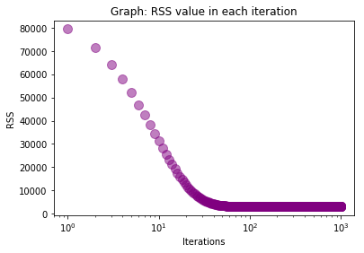
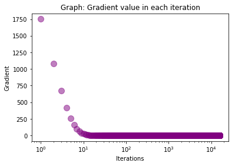

    

# Regressão Linear Simples

## Gradiente descendente

Neste documento usarei gradiente descendente como estratégia de otimização para regressão linear. O código abaixo é executado com uma base de dados (income.csv) contendo anos de escolaridade versus salário. Usarei, a princípio, a taxa de aprendizagem de 0.0001 e o número de iterações igual a 1000.

Percebe-se que, após 1000 iterações, o valor de **w0** (coeficiente linear) foi de -0.18234255376510086, o valor de **w1**(coeficiente angular) foi de 3.262182267596014 e o erro foi de 103.39842291729676. Inicialmente, para **w0** = **w1** = 0, o erro era de 2946.6344970460195.


```python
from numpy import *

def compute_error_for_given_points(w0, w1, points):
    total_error = 0
    
    for i in range(0, len(points)):
        x = points[i, 0]
        y = points[i, 1]        
        total_error += (y - (w1 * x + w0)) **2 
        
    return total_error / float(len(points))
        


def step_gradient(w0_current, w1_current, points, learning_rate):
    # gradient descent
    w0_gradient = 0
    w1_gradient = 0
    N = float(len(points))
    
    for i in range(0, len(points)):
        x = points[i, 0]
        y = points[i, 1]
        w0_gradient += -(2/N) * (y - ((w1_current * x) + w0_current))
        w1_gradient += -(2/N) * x * (y - ((w1_current * x) + w0_current))
        
    new_w0 = w0_current - (learning_rate * w0_gradient)
    new_w1 = w1_current - (learning_rate * w1_gradient)
    return [new_w0, new_w1]
    

def gradient_descent_runner(points, starting_w0, starting_w1, learning_rate, num_iterations):
    w0 = starting_w0
    w1 = starting_w1
    
    for i in range(num_iterations):
        w0, w1 = step_gradient(w0, w1, array(points), learning_rate)
    return [w0, w1]
        

def run():
    points = genfromtxt('income.csv', delimiter=",")    
    learning_rate = 0.0001
    
    initial_w0 = 0
    initial_w1 = 0
    num_iterations = 1000
       
    print("Starting gradient descent at w0 = {0}, w1 = {1}, error = {2}".format(initial_w0, initial_w1, compute_error_for_given_points(initial_w0, initial_w1, points)))
    print("Running...")
    [w0, w1] = gradient_descent_runner(points, initial_w0, initial_w1, learning_rate, num_iterations)
    print("After {0} iterations w0 = {1}, w1 = {2}, error = {3}".format(num_iterations, w0, w1, compute_error_for_given_points(w0, w1, points)))
    

run()

```

    Starting gradient descent at w0 = 0, w1 = 0, error = 2946.6344970460195
    Running...
    After 1000 iterations w0 = -0.18234255376510086, w1 = 3.262182267596014, error = 103.39842291729676
    

### RSS

Vamos agora imprimir o RSS (soma dos erros quadrados) a cada iteração do gradiente descendente. 
Para isso, definirei a função *compute_rss* que será chamara a cada iteração da função *gradient_descent_runner*.

Como é possível perceber, o valor do RSS cai a cada iteração, sendo essa queda maior nas primeiras iterações. Para facilitar a visualização, um gráfico com os valores do RSS foi plotado. O eixo x, que representa o número de iterações, é exibido em escala logarítmica, para que fique mais fácil de visualizar o valor do RSS decrescendo.
 


```python
import matplotlib.pyplot as plt

def compute_rss(w0, w1, points):
    total_error = 0
    
    for i in range(0, len(points)):
        x = points[i, 0]
        y = points[i, 1]        
        total_error += (y - (w1 * x + w0)) **2 
        
    return total_error
        
def plot_rss(rss_array):
    iterations_array = range(1, len(rss_array)+1)
    plt.scatter(iterations_array, rss_array, alpha=0.5, s=100, c="purple")
    plt.title('Graph: RSS value in each iteration')
    plt.xlabel("Iterations")
    plt.ylabel("RSS")
    plt.xscale('log')
    plt.show()

def gradient_descent_runner(points, starting_w0, starting_w1, learning_rate, num_iterations):
    w0= starting_w0
    w1 = starting_w1
    rss_array = []
    
    for i in range(num_iterations):
        w0, w1 = step_gradient(w0, w1, array(points), learning_rate)
        
        rss_current = compute_rss(w0, w1, points)
        rss_array.append(rss_current)        
        print('RSS = {0} - ITERATION = {1}'.format(rss_current, i+1))
    
    plot_rss(rss_array)   
    
    return [w0, w1]

run()
```

    Starting gradient descent at w0 = 0, w1 = 0, error = 2946.6344970460195
    Running...
    RSS = 79447.14379878416 - ITERATION = 1
    RSS = 71435.20777869043 - ITERATION = 2
    RSS = 64264.53040961913 - ITERATION = 3
    RSS = 57846.77849791643 - ITERATION = 4
    RSS = 52102.89394397851 - ITERATION = 5
    RSS = 46962.119845960995 - ITERATION = 6
    RSS = 42361.12886379743 - ITERATION = 7
    RSS = 38243.24310606869 - ITERATION = 8
    RSS = 34557.73592971116 - ITERATION = 9
    RSS = 31259.207051614892 - ITERATION = 10
    RSS = 28307.023274273037 - ITERATION = 11
    RSS = 25664.817935926396 - ITERATION = 12
    RSS = 23300.042919058902 - ITERATION = 13
    RSS = 21183.567698552353 - ITERATION = 14
    RSS = 19289.320490278456 - ITERATION = 15
    RSS = 17593.96707953032 - ITERATION = 16
    RSS = 16076.623372863956 - ITERATION = 17
    RSS = 14718.598132350142 - ITERATION = 18
    RSS = 13503.162723046531 - ITERATION = 19
    RSS = 12415.345037268555 - ITERATION = 20
    RSS = 11441.745057065482 - ITERATION = 21
    RSS = 10570.369782863547 - ITERATION = 22
    RSS = 9790.485494804614 - ITERATION = 23
    RSS = 9092.485526826244 - ITERATION = 24
    RSS = 8467.771924625973 - ITERATION = 25
    RSS = 7908.649529685073 - ITERATION = 26
    RSS = 7408.231184600101 - ITERATION = 27
    RSS = 6960.352891971379 - ITERATION = 28
    RSS = 6559.497881712548 - ITERATION = 29
    RSS = 6200.728651386109 - ITERATION = 30
    RSS = 5879.626142387334 - ITERATION = 31
    RSS = 5592.235302703772 - ITERATION = 32
    RSS = 5335.0163656519635 - ITERATION = 33
    RSS = 5104.801244406793 - ITERATION = 34
    RSS = 4898.754505158914 - ITERATION = 35
    RSS = 4714.338438138678 - ITERATION = 36
    RSS = 4549.28179622555 - ITERATION = 37
    RSS = 4401.551816041983 - ITERATION = 38
    RSS = 4269.329176866909 - ITERATION = 39
    RSS = 4150.985588894107 - ITERATION = 40
    RSS = 4045.0637347510246 - ITERATION = 41
    RSS = 3950.2593171828303 - ITERATION = 42
    RSS = 3865.4049917517095 - ITERATION = 43
    RSS = 3789.4559866225372 - ITERATION = 44
    RSS = 3721.477232288723 - ITERATION = 45
    RSS = 3660.631842692717 - ITERATION = 46
    RSS = 3606.1708058430027 - ITERATION = 47
    RSS = 3557.4237569290235 - ITERATION = 48
    RSS = 3513.790720270382 - ITERATION = 49
    RSS = 3474.734718371543 - ITERATION = 50
    RSS = 3439.775157034888 - ITERATION = 51
    RSS = 3408.481905045042 - ITERATION = 52
    RSS = 3380.4699954936254 - ITERATION = 53
    RSS = 3355.394883471439 - ITERATION = 54
    RSS = 3332.9482017087944 - ITERATION = 55
    RSS = 3312.8539618788423 - ITERATION = 56
    RSS = 3294.8651547687296 - ITERATION = 57
    RSS = 3278.7607074369553 - ITERATION = 58
    RSS = 3264.3427598729595 - ITERATION = 59
    RSS = 3251.4342276108086 - ITERATION = 60
    RSS = 3239.8766202714364 - ITERATION = 61
    RSS = 3229.5280891606403 - ITERATION = 62
    RSS = 3220.261679871688 - ITERATION = 63
    RSS = 3211.963768366804 - ITERATION = 64
    RSS = 3204.5326612720132 - ITERATION = 65
    RSS = 3197.877343142775 - ITERATION = 66
    RSS = 3191.9163552682376 - ITERATION = 67
    RSS = 3186.5767922024424 - ITERATION = 68
    RSS = 3181.7934036609845 - ITERATION = 69
    RSS = 3177.5077907196255 - ITERATION = 70
    RSS = 3173.6676864130436 - ITERATION = 71
    RSS = 3170.2263118716055 - ITERATION = 72
    RSS = 3167.1418000645626 - ITERATION = 73
    RSS = 3164.3766800509134 - ITERATION = 74
    RSS = 3161.8974153845866 - ITERATION = 75
    RSS = 3159.6739909876146 - ITERATION = 76
    RSS = 3157.6795434021597 - ITERATION = 77
    RSS = 3155.890029866517 - ITERATION = 78
    RSS = 3154.2839321385495 - ITERATION = 79
    RSS = 3152.8419914180276 - ITERATION = 80
    RSS = 3151.5469711024457 - ITERATION = 81
    RSS = 3150.3834444537742 - ITERATION = 82
    RSS = 3149.3376045604605 - ITERATION = 83
    RSS = 3148.397094253656 - ITERATION = 84
    RSS = 3147.5508538824565 - ITERATION = 85
    RSS = 3146.788985072899 - ITERATION = 86
    RSS = 3146.1026287924747 - ITERATION = 87
    RSS = 3145.4838562179925 - ITERATION = 88
    RSS = 3144.9255710624484 - ITERATION = 89
    RSS = 3144.4214221577085 - ITERATION = 90
    RSS = 3143.965725216106 - ITERATION = 91
    RSS = 3143.553392807174 - ITERATION = 92
    RSS = 3143.179871686907 - ITERATION = 93
    RSS = 3142.841086707521 - ITERATION = 94
    RSS = 3142.5333906167602 - ITERATION = 95
    RSS = 3142.25351912835 - ITERATION = 96
    RSS = 3141.9985507100805 - ITERATION = 97
    RSS = 3141.765870594224 - ITERATION = 98
    RSS = 3141.553138566882 - ITERATION = 99
    RSS = 3141.3582601394914 - ITERATION = 100
    RSS = 3141.179360747366 - ITERATION = 101
    RSS = 3141.0147626574144 - ITERATION = 102
    RSS = 3140.862964300586 - ITERATION = 103
    RSS = 3140.722621774424 - ITERATION = 104
    RSS = 3140.5925322878875 - ITERATION = 105
    RSS = 3140.471619344462 - ITERATION = 106
    RSS = 3140.3589194811075 - ITERATION = 107
    RSS = 3140.2535703995727 - ITERATION = 108
    RSS = 3140.154800343989 - ITERATION = 109
    RSS = 3140.0619185938003 - ITERATION = 110
    RSS = 3139.9743069549577 - ITERATION = 111
    RSS = 3139.8914121445464 - ITERATION = 112
    RSS = 3139.8127389750375 - ITERATION = 113
    RSS = 3139.737844254202 - ITERATION = 114
    RSS = 3139.666331325538 - ITERATION = 115
    RSS = 3139.5978451819597 - ITERATION = 116
    RSS = 3139.5320680925633 - ITERATION = 117
    RSS = 3139.4687156885793 - ITERATION = 118
    RSS = 3139.407533460306 - ITERATION = 119
    RSS = 3139.348293621875 - ITERATION = 120
    RSS = 3139.2907923052126 - ITERATION = 121
    RSS = 3139.234847048634 - ITERATION = 122
    RSS = 3139.180294549166 - ITERATION = 123
    RSS = 3139.1269886508408 - ITERATION = 124
    RSS = 3139.074798544246 - ITERATION = 125
    RSS = 3139.023607155114 - ITERATION = 126
    RSS = 3138.973309702123 - ITERATION = 127
    RSS = 3138.92381240612 - ITERATION = 128
    RSS = 3138.8750313348646 - ITERATION = 129
    RSS = 3138.8268913691163 - ITERATION = 130
    RSS = 3138.7793252772362 - ITERATION = 131
    RSS = 3138.7322728869954 - ITERATION = 132
    RSS = 3138.6856803443175 - ITERATION = 133
    RSS = 3138.639499449869 - ITERATION = 134
    RSS = 3138.593687065308 - ITERATION = 135
    RSS = 3138.5482045818653 - ITERATION = 136
    RSS = 3138.503017444739 - ITERATION = 137
    RSS = 3138.4580947274244 - ITERATION = 138
    RSS = 3138.413408750738 - ITERATION = 139
    RSS = 3138.3689347418353 - ITERATION = 140
    RSS = 3138.3246505290576 - ITERATION = 141
    RSS = 3138.28053626879 - ITERATION = 142
    RSS = 3138.236574201025 - ITERATION = 143
    RSS = 3138.192748430576 - ITERATION = 144
    RSS = 3138.1490447312626 - ITERATION = 145
    RSS = 3138.1054503706778 - ITERATION = 146
    RSS = 3138.061953953321 - ITERATION = 147
    RSS = 3138.018545280241 - ITERATION = 148
    RSS = 3137.975215223383 - ITERATION = 149
    RSS = 3137.931955613152 - ITERATION = 150
    RSS = 3137.8887591377616 - ITERATION = 151
    RSS = 3137.845619253174 - ITERATION = 152
    RSS = 3137.8025301024845 - ITERATION = 153
    RSS = 3137.7594864437638 - ITERATION = 154
    RSS = 3137.716483585496 - ITERATION = 155
    RSS = 3137.6735173287716 - ITERATION = 156
    RSS = 3137.6305839155775 - ITERATION = 157
    RSS = 3137.5876799824873 - ITERATION = 158
    RSS = 3137.5448025192445 - ITERATION = 159
    RSS = 3137.501948831665 - ITERATION = 160
    RSS = 3137.4591165084585 - ITERATION = 161
    RSS = 3137.4163033915243 - ITERATION = 162
    RSS = 3137.3735075493605 - ITERATION = 163
    RSS = 3137.330727253272 - ITERATION = 164
    RSS = 3137.2879609560787 - ITERATION = 165
    RSS = 3137.245207273057 - ITERATION = 166
    RSS = 3137.202464964877 - ITERATION = 167
    RSS = 3137.1597329223387 - ITERATION = 168
    RSS = 3137.117010152706 - ITERATION = 169
    RSS = 3137.074295767485 - ITERATION = 170
    RSS = 3137.0315889714666 - ITERATION = 171
    RSS = 3136.9888890529414 - ITERATION = 172
    RSS = 3136.946195374933 - ITERATION = 173
    RSS = 3136.9035073673367 - ITERATION = 174
    RSS = 3136.8608245199116 - ITERATION = 175
    RSS = 3136.8181463759997 - ITERATION = 176
    RSS = 3136.7754725268815 - ITERATION = 177
    RSS = 3136.7328026067535 - ITERATION = 178
    RSS = 3136.6901362882213 - ITERATION = 179
    RSS = 3136.6474732782694 - ITERATION = 180
    RSS = 3136.6048133146387 - ITERATION = 181
    RSS = 3136.562156162615 - ITERATION = 182
    RSS = 3136.5195016121233 - ITERATION = 183
    RSS = 3136.476849475146 - ITERATION = 184
    RSS = 3136.4341995834075 - ITERATION = 185
    RSS = 3136.391551786297 - ITERATION = 186
    RSS = 3136.3489059490184 - ITERATION = 187
    RSS = 3136.306261950923 - ITERATION = 188
    RSS = 3136.2636196840385 - ITERATION = 189
    RSS = 3136.2209790517186 - ITERATION = 190
    RSS = 3136.1783399674673 - ITERATION = 191
    RSS = 3136.1357023538694 - ITERATION = 192
    RSS = 3136.093066141642 - ITERATION = 193
    RSS = 3136.050431268763 - ITERATION = 194
    RSS = 3136.0077976797284 - ITERATION = 195
    RSS = 3135.965165324863 - ITERATION = 196
    RSS = 3135.9225341597007 - ITERATION = 197
    RSS = 3135.879904144444 - ITERATION = 198
    RSS = 3135.8372752434784 - ITERATION = 199
    RSS = 3135.794647424918 - ITERATION = 200
    RSS = 3135.752020660229 - ITERATION = 201
    RSS = 3135.709394923874 - ITERATION = 202
    RSS = 3135.6667701929873 - ITERATION = 203
    RSS = 3135.6241464471104 - ITERATION = 204
    RSS = 3135.5815236679314 - ITERATION = 205
    RSS = 3135.538901839049 - ITERATION = 206
    RSS = 3135.496280945798 - ITERATION = 207
    RSS = 3135.4536609750385 - ITERATION = 208
    RSS = 3135.411041915017 - ITERATION = 209
    RSS = 3135.368423755207 - ITERATION = 210
    RSS = 3135.3258064861907 - ITERATION = 211
    RSS = 3135.283190099533 - ITERATION = 212
    RSS = 3135.2405745876854 - ITERATION = 213
    RSS = 3135.197959943888 - ITERATION = 214
    RSS = 3135.1553461620915 - ITERATION = 215
    RSS = 3135.112733236881 - ITERATION = 216
    RSS = 3135.070121163403 - ITERATION = 217
    RSS = 3135.0275099373207 - ITERATION = 218
    RSS = 3134.984899554747 - ITERATION = 219
    RSS = 3134.9422900121963 - ITERATION = 220
    RSS = 3134.899681306555 - ITERATION = 221
    RSS = 3134.8570734350265 - ITERATION = 222
    RSS = 3134.8144663951184 - ITERATION = 223
    RSS = 3134.771860184586 - ITERATION = 224
    RSS = 3134.7292548014284 - ITERATION = 225
    RSS = 3134.686650243845 - ITERATION = 226
    RSS = 3134.644046510227 - ITERATION = 227
    RSS = 3134.601443599133 - ITERATION = 228
    RSS = 3134.5588415092716 - ITERATION = 229
    RSS = 3134.5162402394835 - ITERATION = 230
    RSS = 3134.473639788729 - ITERATION = 231
    RSS = 3134.431040156082 - ITERATION = 232
    RSS = 3134.3884413407013 - ITERATION = 233
    RSS = 3134.345843341842 - ITERATION = 234
    RSS = 3134.3032461588296 - ITERATION = 235
    RSS = 3134.260649791067 - ITERATION = 236
    RSS = 3134.2180542380083 - ITERATION = 237
    RSS = 3134.175459499166 - ITERATION = 238
    RSS = 3134.1328655741095 - ITERATION = 239
    RSS = 3134.0902724624425 - ITERATION = 240
    RSS = 3134.0476801638133 - ITERATION = 241
    RSS = 3134.005088677901 - ITERATION = 242
    RSS = 3133.9624980044264 - ITERATION = 243
    RSS = 3133.9199081431275 - ITERATION = 244
    RSS = 3133.877319093777 - ITERATION = 245
    RSS = 3133.8347308561597 - ITERATION = 246
    RSS = 3133.7921434300915 - ITERATION = 247
    RSS = 3133.7495568154004 - ITERATION = 248
    RSS = 3133.706971011932 - ITERATION = 249
    RSS = 3133.664386019548 - ITERATION = 250
    RSS = 3133.6218018381182 - ITERATION = 251
    RSS = 3133.579218467529 - ITERATION = 252
    RSS = 3133.5366359076784 - ITERATION = 253
    RSS = 3133.494054158469 - ITERATION = 254
    RSS = 3133.451473219818 - ITERATION = 255
    RSS = 3133.4088930916373 - ITERATION = 256
    RSS = 3133.366313773863 - ITERATION = 257
    RSS = 3133.3237352664232 - ITERATION = 258
    RSS = 3133.2811575692594 - ITERATION = 259
    RSS = 3133.2385806823163 - ITERATION = 260
    RSS = 3133.196004605538 - ITERATION = 261
    RSS = 3133.1534293388804 - ITERATION = 262
    RSS = 3133.1108548822954 - ITERATION = 263
    RSS = 3133.068281235742 - ITERATION = 264
    RSS = 3133.025708399182 - ITERATION = 265
    RSS = 3132.9831363725807 - ITERATION = 266
    RSS = 3132.940565155898 - ITERATION = 267
    RSS = 3132.89799474911 - ITERATION = 268
    RSS = 3132.8554251521764 - ITERATION = 269
    RSS = 3132.8128563650785 - ITERATION = 270
    RSS = 3132.7702883877796 - ITERATION = 271
    RSS = 3132.7277212202607 - ITERATION = 272
    RSS = 3132.6851548624936 - ITERATION = 273
    RSS = 3132.642589314452 - ITERATION = 274
    RSS = 3132.600024576118 - ITERATION = 275
    RSS = 3132.5574606474643 - ITERATION = 276
    RSS = 3132.5148975284737 - ITERATION = 277
    RSS = 3132.47233521912 - ITERATION = 278
    RSS = 3132.429773719388 - ITERATION = 279
    RSS = 3132.3872130292525 - ITERATION = 280
    RSS = 3132.3446531487 - ITERATION = 281
    RSS = 3132.302094077705 - ITERATION = 282
    RSS = 3132.259535816259 - ITERATION = 283
    RSS = 3132.216978364331 - ITERATION = 284
    RSS = 3132.1744217219143 - ITERATION = 285
    RSS = 3132.131865888984 - ITERATION = 286
    RSS = 3132.0893108655246 - ITERATION = 287
    RSS = 3132.046756651518 - ITERATION = 288
    RSS = 3132.004203246952 - ITERATION = 289
    RSS = 3131.961650651805 - ITERATION = 290
    RSS = 3131.91909886606 - ITERATION = 291
    RSS = 3131.8765478897003 - ITERATION = 292
    RSS = 3131.8339977227133 - ITERATION = 293
    RSS = 3131.7914483650798 - ITERATION = 294
    RSS = 3131.7488998167837 - ITERATION = 295
    RSS = 3131.7063520778083 - ITERATION = 296
    RSS = 3131.6638051481405 - ITERATION = 297
    RSS = 3131.621259027762 - ITERATION = 298
    RSS = 3131.5787137166567 - ITERATION = 299
    RSS = 3131.536169214808 - ITERATION = 300
    RSS = 3131.4936255222033 - ITERATION = 301
    RSS = 3131.451082638824 - ITERATION = 302
    RSS = 3131.4085405646542 - ITERATION = 303
    RSS = 3131.3659992996804 - ITERATION = 304
    RSS = 3131.323458843883 - ITERATION = 305
    RSS = 3131.2809191972533 - ITERATION = 306
    RSS = 3131.238380359767 - ITERATION = 307
    RSS = 3131.1958423314154 - ITERATION = 308
    RSS = 3131.15330511218 - ITERATION = 309
    RSS = 3131.110768702045 - ITERATION = 310
    RSS = 3131.068233100997 - ITERATION = 311
    RSS = 3131.025698309017 - ITERATION = 312
    RSS = 3130.983164326093 - ITERATION = 313
    RSS = 3130.940631152206 - ITERATION = 314
    RSS = 3130.898098787346 - ITERATION = 315
    RSS = 3130.8555672314924 - ITERATION = 316
    RSS = 3130.813036484631 - ITERATION = 317
    RSS = 3130.770506546748 - ITERATION = 318
    RSS = 3130.7279774178232 - ITERATION = 319
    RSS = 3130.685449097848 - ITERATION = 320
    RSS = 3130.6429215868025 - ITERATION = 321
    RSS = 3130.6003948846733 - ITERATION = 322
    RSS = 3130.5578689914414 - ITERATION = 323
    RSS = 3130.515343907097 - ITERATION = 324
    RSS = 3130.472819631621 - ITERATION = 325
    RSS = 3130.4302961649987 - ITERATION = 326
    RSS = 3130.387773507214 - ITERATION = 327
    RSS = 3130.345251658254 - ITERATION = 328
    RSS = 3130.3027306180998 - ITERATION = 329
    RSS = 3130.260210386737 - ITERATION = 330
    RSS = 3130.217690964153 - ITERATION = 331
    RSS = 3130.175172350329 - ITERATION = 332
    RSS = 3130.1326545452507 - ITERATION = 333
    RSS = 3130.0901375489034 - ITERATION = 334
    RSS = 3130.0476213612715 - ITERATION = 335
    RSS = 3130.005105982339 - ITERATION = 336
    RSS = 3129.962591412092 - ITERATION = 337
    RSS = 3129.920077650511 - ITERATION = 338
    RSS = 3129.877564697587 - ITERATION = 339
    RSS = 3129.8350525532987 - ITERATION = 340
    RSS = 3129.792541217634 - ITERATION = 341
    RSS = 3129.7500306905768 - ITERATION = 342
    RSS = 3129.7075209721124 - ITERATION = 343
    RSS = 3129.665012062223 - ITERATION = 344
    RSS = 3129.6225039608967 - ITERATION = 345
    RSS = 3129.579996668114 - ITERATION = 346
    RSS = 3129.5374901838622 - ITERATION = 347
    RSS = 3129.494984508127 - ITERATION = 348
    RSS = 3129.452479640892 - ITERATION = 349
    RSS = 3129.409975582139 - ITERATION = 350
    RSS = 3129.3674723318554 - ITERATION = 351
    RSS = 3129.324969890027 - ITERATION = 352
    RSS = 3129.282468256636 - ITERATION = 353
    RSS = 3129.2399674316684 - ITERATION = 354
    RSS = 3129.1974674151074 - ITERATION = 355
    RSS = 3129.154968206938 - ITERATION = 356
    RSS = 3129.1124698071467 - ITERATION = 357
    RSS = 3129.069972215716 - ITERATION = 358
    RSS = 3129.027475432632 - ITERATION = 359
    RSS = 3128.9849794578777 - ITERATION = 360
    RSS = 3128.9424842914386 - ITERATION = 361
    RSS = 3128.899989933299 - ITERATION = 362
    RSS = 3128.857496383446 - ITERATION = 363
    RSS = 3128.8150036418583 - ITERATION = 364
    RSS = 3128.7725117085283 - ITERATION = 365
    RSS = 3128.7300205834326 - ITERATION = 366
    RSS = 3128.687530266563 - ITERATION = 367
    RSS = 3128.6450407578986 - ITERATION = 368
    RSS = 3128.602552057427 - ITERATION = 369
    RSS = 3128.5600641651336 - ITERATION = 370
    RSS = 3128.5175770810015 - ITERATION = 371
    RSS = 3128.475090805013 - ITERATION = 372
    RSS = 3128.432605337159 - ITERATION = 373
    RSS = 3128.390120677419 - ITERATION = 374
    RSS = 3128.347636825778 - ITERATION = 375
    RSS = 3128.3051537822203 - ITERATION = 376
    RSS = 3128.262671546734 - ITERATION = 377
    RSS = 3128.2201901193007 - ITERATION = 378
    RSS = 3128.177709499906 - ITERATION = 379
    RSS = 3128.135229688538 - ITERATION = 380
    RSS = 3128.0927506851726 - ITERATION = 381
    RSS = 3128.0502724898006 - ITERATION = 382
    RSS = 3128.007795102406 - ITERATION = 383
    RSS = 3127.9653185229754 - ITERATION = 384
    RSS = 3127.9228427514886 - ITERATION = 385
    RSS = 3127.880367787931 - ITERATION = 386
    RSS = 3127.837893632291 - ITERATION = 387
    RSS = 3127.7954202845526 - ITERATION = 388
    RSS = 3127.752947744696 - ITERATION = 389
    RSS = 3127.7104760127127 - ITERATION = 390
    RSS = 3127.6680050885816 - ITERATION = 391
    RSS = 3127.625534972288 - ITERATION = 392
    RSS = 3127.583065663819 - ITERATION = 393
    RSS = 3127.5405971631553 - ITERATION = 394
    RSS = 3127.4981294702884 - ITERATION = 395
    RSS = 3127.4556625851974 - ITERATION = 396
    RSS = 3127.4131965078673 - ITERATION = 397
    RSS = 3127.3707312382844 - ITERATION = 398
    RSS = 3127.328266776434 - ITERATION = 399
    RSS = 3127.285803122296 - ITERATION = 400
    RSS = 3127.2433402758593 - ITERATION = 401
    RSS = 3127.2008782371086 - ITERATION = 402
    RSS = 3127.1584170060282 - ITERATION = 403
    RSS = 3127.1159565826015 - ITERATION = 404
    RSS = 3127.073496966814 - ITERATION = 405
    RSS = 3127.0310381586482 - ITERATION = 406
    RSS = 3126.9885801580945 - ITERATION = 407
    RSS = 3126.9461229651297 - ITERATION = 408
    RSS = 3126.9036665797453 - ITERATION = 409
    RSS = 3126.8612110019208 - ITERATION = 410
    RSS = 3126.818756231644 - ITERATION = 411
    RSS = 3126.7763022689005 - ITERATION = 412
    RSS = 3126.733849113668 - ITERATION = 413
    RSS = 3126.6913967659393 - ITERATION = 414
    RSS = 3126.648945225699 - ITERATION = 415
    RSS = 3126.606494492925 - ITERATION = 416
    RSS = 3126.5640445676067 - ITERATION = 417
    RSS = 3126.521595449727 - ITERATION = 418
    RSS = 3126.4791471392714 - ITERATION = 419
    RSS = 3126.4366996362255 - ITERATION = 420
    RSS = 3126.3942529405717 - ITERATION = 421
    RSS = 3126.351807052296 - ITERATION = 422
    RSS = 3126.3093619713823 - ITERATION = 423
    RSS = 3126.266917697817 - ITERATION = 424
    RSS = 3126.2244742315825 - ITERATION = 425
    RSS = 3126.182031572667 - ITERATION = 426
    RSS = 3126.1395897210505 - ITERATION = 427
    RSS = 3126.0971486767166 - ITERATION = 428
    RSS = 3126.054708439658 - ITERATION = 429
    RSS = 3126.0122690098524 - ITERATION = 430
    RSS = 3125.969830387287 - ITERATION = 431
    RSS = 3125.927392571945 - ITERATION = 432
    RSS = 3125.8849555638103 - ITERATION = 433
    RSS = 3125.8425193628714 - ITERATION = 434
    RSS = 3125.800083969111 - ITERATION = 435
    RSS = 3125.7576493825113 - ITERATION = 436
    RSS = 3125.715215603063 - ITERATION = 437
    RSS = 3125.6727826307424 - ITERATION = 438
    RSS = 3125.630350465542 - ITERATION = 439
    RSS = 3125.5879191074414 - ITERATION = 440
    RSS = 3125.5454885564277 - ITERATION = 441
    RSS = 3125.503058812485 - ITERATION = 442
    RSS = 3125.460629875597 - ITERATION = 443
    RSS = 3125.4182017457492 - ITERATION = 444
    RSS = 3125.3757744229256 - ITERATION = 445
    RSS = 3125.3333479071125 - ITERATION = 446
    RSS = 3125.2909221982927 - ITERATION = 447
    RSS = 3125.248497296452 - ITERATION = 448
    RSS = 3125.2060732015752 - ITERATION = 449
    RSS = 3125.163649913644 - ITERATION = 450
    RSS = 3125.1212274326476 - ITERATION = 451
    RSS = 3125.0788057585687 - ITERATION = 452
    RSS = 3125.0363848913885 - ITERATION = 453
    RSS = 3124.993964831096 - ITERATION = 454
    RSS = 3124.9515455776773 - ITERATION = 455
    RSS = 3124.9091271311127 - ITERATION = 456
    RSS = 3124.8667094913903 - ITERATION = 457
    RSS = 3124.8242926584903 - ITERATION = 458
    RSS = 3124.7818766324026 - ITERATION = 459
    RSS = 3124.739461413106 - ITERATION = 460
    RSS = 3124.6970470005917 - ITERATION = 461
    RSS = 3124.6546333948418 - ITERATION = 462
    RSS = 3124.6122205958377 - ITERATION = 463
    RSS = 3124.5698086035677 - ITERATION = 464
    RSS = 3124.527397418016 - ITERATION = 465
    RSS = 3124.484987039164 - ITERATION = 466
    RSS = 3124.442577467003 - ITERATION = 467
    RSS = 3124.400168701514 - ITERATION = 468
    RSS = 3124.3577607426787 - ITERATION = 469
    RSS = 3124.315353590483 - ITERATION = 470
    RSS = 3124.272947244917 - ITERATION = 471
    RSS = 3124.230541705959 - ITERATION = 472
    RSS = 3124.188136973596 - ITERATION = 473
    RSS = 3124.145733047813 - ITERATION = 474
    RSS = 3124.103329928596 - ITERATION = 475
    RSS = 3124.0609276159257 - ITERATION = 476
    RSS = 3124.0185261097904 - ITERATION = 477
    RSS = 3123.9761254101736 - ITERATION = 478
    RSS = 3123.9337255170562 - ITERATION = 479
    RSS = 3123.891326430433 - ITERATION = 480
    RSS = 3123.848928150277 - ITERATION = 481
    RSS = 3123.806530676578 - ITERATION = 482
    RSS = 3123.764134009321 - ITERATION = 483
    RSS = 3123.7217381484916 - ITERATION = 484
    RSS = 3123.6793430940734 - ITERATION = 485
    RSS = 3123.6369488460505 - ITERATION = 486
    RSS = 3123.594555404405 - ITERATION = 487
    RSS = 3123.5521627691282 - ITERATION = 488
    RSS = 3123.509770940199 - ITERATION = 489
    RSS = 3123.4673799176053 - ITERATION = 490
    RSS = 3123.42498970133 - ITERATION = 491
    RSS = 3123.3826002913597 - ITERATION = 492
    RSS = 3123.3402116876746 - ITERATION = 493
    RSS = 3123.2978238902638 - ITERATION = 494
    RSS = 3123.2554368991096 - ITERATION = 495
    RSS = 3123.213050714199 - ITERATION = 496
    RSS = 3123.1706653355154 - ITERATION = 497
    RSS = 3123.128280763043 - ITERATION = 498
    RSS = 3123.085896996766 - ITERATION = 499
    RSS = 3123.043514036671 - ITERATION = 500
    RSS = 3123.001131882739 - ITERATION = 501
    RSS = 3122.9587505349605 - ITERATION = 502
    RSS = 3122.9163699933133 - ITERATION = 503
    RSS = 3122.873990257788 - ITERATION = 504
    RSS = 3122.8316113283668 - ITERATION = 505
    RSS = 3122.789233205035 - ITERATION = 506
    RSS = 3122.7468558877754 - ITERATION = 507
    RSS = 3122.7044793765763 - ITERATION = 508
    RSS = 3122.6621036714164 - ITERATION = 509
    RSS = 3122.619728772287 - ITERATION = 510
    RSS = 3122.5773546791697 - ITERATION = 511
    RSS = 3122.534981392049 - ITERATION = 512
    RSS = 3122.4926089109085 - ITERATION = 513
    RSS = 3122.450237235734 - ITERATION = 514
    RSS = 3122.4078663665146 - ITERATION = 515
    RSS = 3122.365496303224 - ITERATION = 516
    RSS = 3122.323127045859 - ITERATION = 517
    RSS = 3122.280758594398 - ITERATION = 518
    RSS = 3122.238390948823 - ITERATION = 519
    RSS = 3122.1960241091265 - ITERATION = 520
    RSS = 3122.153658075287 - ITERATION = 521
    RSS = 3122.1112928472903 - ITERATION = 522
    RSS = 3122.0689284251243 - ITERATION = 523
    RSS = 3122.02656480877 - ITERATION = 524
    RSS = 3121.9842019982116 - ITERATION = 525
    RSS = 3121.941839993439 - ITERATION = 526
    RSS = 3121.899478794431 - ITERATION = 527
    RSS = 3121.857118401175 - ITERATION = 528
    RSS = 3121.8147588136553 - ITERATION = 529
    RSS = 3121.7724000318563 - ITERATION = 530
    RSS = 3121.7300420557617 - ITERATION = 531
    RSS = 3121.6876848853594 - ITERATION = 532
    RSS = 3121.6453285206335 - ITERATION = 533
    RSS = 3121.6029729615643 - ITERATION = 534
    RSS = 3121.560618208141 - ITERATION = 535
    RSS = 3121.518264260346 - ITERATION = 536
    RSS = 3121.4759111181666 - ITERATION = 537
    RSS = 3121.4335587815826 - ITERATION = 538
    RSS = 3121.391207250582 - ITERATION = 539
    RSS = 3121.34885652515 - ITERATION = 540
    RSS = 3121.306506605271 - ITERATION = 541
    RSS = 3121.2641574909276 - ITERATION = 542
    RSS = 3121.221809182109 - ITERATION = 543
    RSS = 3121.1794616787924 - ITERATION = 544
    RSS = 3121.13711498097 - ITERATION = 545
    RSS = 3121.0947690886237 - ITERATION = 546
    RSS = 3121.0524240017367 - ITERATION = 547
    RSS = 3121.0100797202967 - ITERATION = 548
    RSS = 3120.967736244283 - ITERATION = 549
    RSS = 3120.9253935736842 - ITERATION = 550
    RSS = 3120.883051708488 - ITERATION = 551
    RSS = 3120.840710648672 - ITERATION = 552
    RSS = 3120.7983703942273 - ITERATION = 553
    RSS = 3120.7560309451364 - ITERATION = 554
    RSS = 3120.7136923013813 - ITERATION = 555
    RSS = 3120.6713544629483 - ITERATION = 556
    RSS = 3120.629017429823 - ITERATION = 557
    RSS = 3120.586681201991 - ITERATION = 558
    RSS = 3120.5443457794345 - ITERATION = 559
    RSS = 3120.5020111621384 - ITERATION = 560
    RSS = 3120.4596773500903 - ITERATION = 561
    RSS = 3120.417344343272 - ITERATION = 562
    RSS = 3120.3750121416683 - ITERATION = 563
    RSS = 3120.332680745267 - ITERATION = 564
    RSS = 3120.2903501540486 - ITERATION = 565
    RSS = 3120.248020368 - ITERATION = 566
    RSS = 3120.2056913871065 - ITERATION = 567
    RSS = 3120.16336321135 - ITERATION = 568
    RSS = 3120.1210358407175 - ITERATION = 569
    RSS = 3120.078709275192 - ITERATION = 570
    RSS = 3120.036383514762 - ITERATION = 571
    RSS = 3119.9940585594095 - ITERATION = 572
    RSS = 3119.9517344091164 - ITERATION = 573
    RSS = 3119.909411063872 - ITERATION = 574
    RSS = 3119.8670885236616 - ITERATION = 575
    RSS = 3119.824766788462 - ITERATION = 576
    RSS = 3119.782445858269 - ITERATION = 577
    RSS = 3119.740125733058 - ITERATION = 578
    RSS = 3119.6978064128193 - ITERATION = 579
    RSS = 3119.655487897534 - ITERATION = 580
    RSS = 3119.6131701871886 - ITERATION = 581
    RSS = 3119.5708532817707 - ITERATION = 582
    RSS = 3119.5285371812574 - ITERATION = 583
    RSS = 3119.486221885639 - ITERATION = 584
    RSS = 3119.443907394904 - ITERATION = 585
    RSS = 3119.4015937090267 - ITERATION = 586
    RSS = 3119.3592808279986 - ITERATION = 587
    RSS = 3119.316968751802 - ITERATION = 588
    RSS = 3119.274657480424 - ITERATION = 589
    RSS = 3119.2323470138504 - ITERATION = 590
    RSS = 3119.190037352058 - ITERATION = 591
    RSS = 3119.1477284950415 - ITERATION = 592
    RSS = 3119.1054204427787 - ITERATION = 593
    RSS = 3119.063113195258 - ITERATION = 594
    RSS = 3119.0208067524604 - ITERATION = 595
    RSS = 3118.978501114374 - ITERATION = 596
    RSS = 3118.9361962809844 - ITERATION = 597
    RSS = 3118.893892252273 - ITERATION = 598
    RSS = 3118.8515890282247 - ITERATION = 599
    RSS = 3118.8092866088264 - ITERATION = 600
    RSS = 3118.7669849940603 - ITERATION = 601
    RSS = 3118.7246841839146 - ITERATION = 602
    RSS = 3118.682384178371 - ITERATION = 603
    RSS = 3118.640084977414 - ITERATION = 604
    RSS = 3118.5977865810314 - ITERATION = 605
    RSS = 3118.555488989205 - ITERATION = 606
    RSS = 3118.513192201918 - ITERATION = 607
    RSS = 3118.470896219161 - ITERATION = 608
    RSS = 3118.4286010409132 - ITERATION = 609
    RSS = 3118.386306667163 - ITERATION = 610
    RSS = 3118.34401309789 - ITERATION = 611
    RSS = 3118.301720333085 - ITERATION = 612
    RSS = 3118.2594283727285 - ITERATION = 613
    RSS = 3118.217137216808 - ITERATION = 614
    RSS = 3118.1748468653063 - ITERATION = 615
    RSS = 3118.132557318207 - ITERATION = 616
    RSS = 3118.0902685755004 - ITERATION = 617
    RSS = 3118.0479806371636 - ITERATION = 618
    RSS = 3118.0056935031857 - ITERATION = 619
    RSS = 3117.963407173552 - ITERATION = 620
    RSS = 3117.921121648243 - ITERATION = 621
    RSS = 3117.8788369272484 - ITERATION = 622
    RSS = 3117.8365530105507 - ITERATION = 623
    RSS = 3117.7942698981337 - ITERATION = 624
    RSS = 3117.7519875899843 - ITERATION = 625
    RSS = 3117.709706086086 - ITERATION = 626
    RSS = 3117.667425386422 - ITERATION = 627
    RSS = 3117.625145490979 - ITERATION = 628
    RSS = 3117.5828663997404 - ITERATION = 629
    RSS = 3117.5405881126926 - ITERATION = 630
    RSS = 3117.498310629821 - ITERATION = 631
    RSS = 3117.456033951105 - ITERATION = 632
    RSS = 3117.4137580765364 - ITERATION = 633
    RSS = 3117.371483006095 - ITERATION = 634
    RSS = 3117.3292087397667 - ITERATION = 635
    RSS = 3117.2869352775356 - ITERATION = 636
    RSS = 3117.244662619389 - ITERATION = 637
    RSS = 3117.202390765308 - ITERATION = 638
    RSS = 3117.160119715281 - ITERATION = 639
    RSS = 3117.117849469292 - ITERATION = 640
    RSS = 3117.075580027323 - ITERATION = 641
    RSS = 3117.0333113893594 - ITERATION = 642
    RSS = 3116.991043555386 - ITERATION = 643
    RSS = 3116.9487765253925 - ITERATION = 644
    RSS = 3116.906510299357 - ITERATION = 645
    RSS = 3116.864244877266 - ITERATION = 646
    RSS = 3116.8219802591034 - ITERATION = 647
    RSS = 3116.779716444858 - ITERATION = 648
    RSS = 3116.7374534345126 - ITERATION = 649
    RSS = 3116.6951912280474 - ITERATION = 650
    RSS = 3116.652929825455 - ITERATION = 651
    RSS = 3116.610669226712 - ITERATION = 652
    RSS = 3116.5684094318103 - ITERATION = 653
    RSS = 3116.526150440732 - ITERATION = 654
    RSS = 3116.4838922534614 - ITERATION = 655
    RSS = 3116.441634869978 - ITERATION = 656
    RSS = 3116.3993782902753 - ITERATION = 657
    RSS = 3116.357122514334 - ITERATION = 658
    RSS = 3116.3148675421407 - ITERATION = 659
    RSS = 3116.2726133736746 - ITERATION = 660
    RSS = 3116.2303600089263 - ITERATION = 661
    RSS = 3116.1881074478806 - ITERATION = 662
    RSS = 3116.145855690518 - ITERATION = 663
    RSS = 3116.103604736825 - ITERATION = 664
    RSS = 3116.0613545867864 - ITERATION = 665
    RSS = 3116.0191052403866 - ITERATION = 666
    RSS = 3115.9768566976127 - ITERATION = 667
    RSS = 3115.934608958447 - ITERATION = 668
    RSS = 3115.8923620228747 - ITERATION = 669
    RSS = 3115.8501158908816 - ITERATION = 670
    RSS = 3115.8078705624503 - ITERATION = 671
    RSS = 3115.7656260375666 - ITERATION = 672
    RSS = 3115.7233823162155 - ITERATION = 673
    RSS = 3115.6811393983835 - ITERATION = 674
    RSS = 3115.63889728405 - ITERATION = 675
    RSS = 3115.5966559732037 - ITERATION = 676
    RSS = 3115.5544154658296 - ITERATION = 677
    RSS = 3115.512175761911 - ITERATION = 678
    RSS = 3115.469936861433 - ITERATION = 679
    RSS = 3115.427698764381 - ITERATION = 680
    RSS = 3115.3854614707393 - ITERATION = 681
    RSS = 3115.343224980492 - ITERATION = 682
    RSS = 3115.300989293624 - ITERATION = 683
    RSS = 3115.25875441012 - ITERATION = 684
    RSS = 3115.2165203299655 - ITERATION = 685
    RSS = 3115.174287053143 - ITERATION = 686
    RSS = 3115.1320545796393 - ITERATION = 687
    RSS = 3115.089822909442 - ITERATION = 688
    RSS = 3115.0475920425297 - ITERATION = 689
    RSS = 3115.0053619788905 - ITERATION = 690
    RSS = 3114.9631327185075 - ITERATION = 691
    RSS = 3114.920904261369 - ITERATION = 692
    RSS = 3114.8786766074554 - ITERATION = 693
    RSS = 3114.8364497567536 - ITERATION = 694
    RSS = 3114.7942237092475 - ITERATION = 695
    RSS = 3114.751998464924 - ITERATION = 696
    RSS = 3114.709774023765 - ITERATION = 697
    RSS = 3114.6675503857577 - ITERATION = 698
    RSS = 3114.6253275508834 - ITERATION = 699
    RSS = 3114.5831055191297 - ITERATION = 700
    RSS = 3114.5408842904817 - ITERATION = 701
    RSS = 3114.49866386492 - ITERATION = 702
    RSS = 3114.456444242435 - ITERATION = 703
    RSS = 3114.414225423008 - ITERATION = 704
    RSS = 3114.372007406623 - ITERATION = 705
    RSS = 3114.329790193268 - ITERATION = 706
    RSS = 3114.2875737829254 - ITERATION = 707
    RSS = 3114.24535817558 - ITERATION = 708
    RSS = 3114.2031433712177 - ITERATION = 709
    RSS = 3114.1609293698234 - ITERATION = 710
    RSS = 3114.118716171378 - ITERATION = 711
    RSS = 3114.076503775869 - ITERATION = 712
    RSS = 3114.0342921832817 - ITERATION = 713
    RSS = 3113.992081393602 - ITERATION = 714
    RSS = 3113.949871406813 - ITERATION = 715
    RSS = 3113.9076622228968 - ITERATION = 716
    RSS = 3113.8654538418446 - ITERATION = 717
    RSS = 3113.823246263634 - ITERATION = 718
    RSS = 3113.7810394882554 - ITERATION = 719
    RSS = 3113.7388335156897 - ITERATION = 720
    RSS = 3113.6966283459246 - ITERATION = 721
    RSS = 3113.654423978941 - ITERATION = 722
    RSS = 3113.6122204147277 - ITERATION = 723
    RSS = 3113.5700176532655 - ITERATION = 724
    RSS = 3113.5278156945446 - ITERATION = 725
    RSS = 3113.4856145385443 - ITERATION = 726
    RSS = 3113.4434141852503 - ITERATION = 727
    RSS = 3113.401214634651 - ITERATION = 728
    RSS = 3113.3590158867282 - ITERATION = 729
    RSS = 3113.316817941465 - ITERATION = 730
    RSS = 3113.274620798848 - ITERATION = 731
    RSS = 3113.232424458865 - ITERATION = 732
    RSS = 3113.190228921495 - ITERATION = 733
    RSS = 3113.1480341867305 - ITERATION = 734
    RSS = 3113.1058402545455 - ITERATION = 735
    RSS = 3113.0636471249327 - ITERATION = 736
    RSS = 3113.0214547978767 - ITERATION = 737
    RSS = 3112.979263273357 - ITERATION = 738
    RSS = 3112.9370725513622 - ITERATION = 739
    RSS = 3112.894882631878 - ITERATION = 740
    RSS = 3112.8526935148866 - ITERATION = 741
    RSS = 3112.810505200372 - ITERATION = 742
    RSS = 3112.768317688324 - ITERATION = 743
    RSS = 3112.7261309787204 - ITERATION = 744
    RSS = 3112.683945071553 - ITERATION = 745
    RSS = 3112.6417599668002 - ITERATION = 746
    RSS = 3112.59957566445 - ITERATION = 747
    RSS = 3112.5573921644886 - ITERATION = 748
    RSS = 3112.5152094668956 - ITERATION = 749
    RSS = 3112.4730275716615 - ITERATION = 750
    RSS = 3112.4308464787696 - ITERATION = 751
    RSS = 3112.3886661881984 - ITERATION = 752
    RSS = 3112.3464866999416 - ITERATION = 753
    RSS = 3112.3043080139814 - ITERATION = 754
    RSS = 3112.262130130298 - ITERATION = 755
    RSS = 3112.2199530488806 - ITERATION = 756
    RSS = 3112.177776769714 - ITERATION = 757
    RSS = 3112.135601292779 - ITERATION = 758
    RSS = 3112.093426618064 - ITERATION = 759
    RSS = 3112.0512527455544 - ITERATION = 760
    RSS = 3112.0090796752343 - ITERATION = 761
    RSS = 3111.9669074070816 - ITERATION = 762
    RSS = 3111.924735941091 - ITERATION = 763
    RSS = 3111.8825652772443 - ITERATION = 764
    RSS = 3111.8403954155224 - ITERATION = 765
    RSS = 3111.7982263559147 - ITERATION = 766
    RSS = 3111.756058098402 - ITERATION = 767
    RSS = 3111.713890642972 - ITERATION = 768
    RSS = 3111.6717239896084 - ITERATION = 769
    RSS = 3111.6295581382947 - ITERATION = 770
    RSS = 3111.587393089019 - ITERATION = 771
    RSS = 3111.545228841762 - ITERATION = 772
    RSS = 3111.5030653965127 - ITERATION = 773
    RSS = 3111.460902753252 - ITERATION = 774
    RSS = 3111.418740911968 - ITERATION = 775
    RSS = 3111.3765798726404 - ITERATION = 776
    RSS = 3111.334419635259 - ITERATION = 777
    RSS = 3111.2922601998066 - ITERATION = 778
    RSS = 3111.250101566268 - ITERATION = 779
    RSS = 3111.2079437346288 - ITERATION = 780
    RSS = 3111.165786704872 - ITERATION = 781
    RSS = 3111.123630476984 - ITERATION = 782
    RSS = 3111.081475050948 - ITERATION = 783
    RSS = 3111.0393204267507 - ITERATION = 784
    RSS = 3110.9971666043757 - ITERATION = 785
    RSS = 3110.955013583807 - ITERATION = 786
    RSS = 3110.912861365029 - ITERATION = 787
    RSS = 3110.870709948029 - ITERATION = 788
    RSS = 3110.828559332792 - ITERATION = 789
    RSS = 3110.7864095192986 - ITERATION = 790
    RSS = 3110.744260507538 - ITERATION = 791
    RSS = 3110.702112297492 - ITERATION = 792
    RSS = 3110.6599648891456 - ITERATION = 793
    RSS = 3110.617818282485 - ITERATION = 794
    RSS = 3110.575672477495 - ITERATION = 795
    RSS = 3110.5335274741565 - ITERATION = 796
    RSS = 3110.4913832724615 - ITERATION = 797
    RSS = 3110.4492398723883 - ITERATION = 798
    RSS = 3110.4070972739255 - ITERATION = 799
    RSS = 3110.364955477055 - ITERATION = 800
    RSS = 3110.3228144817645 - ITERATION = 801
    RSS = 3110.2806742880357 - ITERATION = 802
    RSS = 3110.2385348958537 - ITERATION = 803
    RSS = 3110.1963963052067 - ITERATION = 804
    RSS = 3110.1542585160737 - ITERATION = 805
    RSS = 3110.112121528447 - ITERATION = 806
    RSS = 3110.0699853423052 - ITERATION = 807
    RSS = 3110.0278499576348 - ITERATION = 808
    RSS = 3109.9857153744215 - ITERATION = 809
    RSS = 3109.9435815926486 - ITERATION = 810
    RSS = 3109.9014486123033 - ITERATION = 811
    RSS = 3109.859316433364 - ITERATION = 812
    RSS = 3109.817185055826 - ITERATION = 813
    RSS = 3109.775054479667 - ITERATION = 814
    RSS = 3109.73292470487 - ITERATION = 815
    RSS = 3109.6907957314243 - ITERATION = 816
    RSS = 3109.648667559315 - ITERATION = 817
    RSS = 3109.6065401885207 - ITERATION = 818
    RSS = 3109.5644136190335 - ITERATION = 819
    RSS = 3109.5222878508353 - ITERATION = 820
    RSS = 3109.4801628839105 - ITERATION = 821
    RSS = 3109.438038718241 - ITERATION = 822
    RSS = 3109.3959153538176 - ITERATION = 823
    RSS = 3109.3537927906204 - ITERATION = 824
    RSS = 3109.3116710286376 - ITERATION = 825
    RSS = 3109.2695500678506 - ITERATION = 826
    RSS = 3109.2274299082433 - ITERATION = 827
    RSS = 3109.1853105498067 - ITERATION = 828
    RSS = 3109.14319199252 - ITERATION = 829
    RSS = 3109.1010742363696 - ITERATION = 830
    RSS = 3109.058957281341 - ITERATION = 831
    RSS = 3109.0168411274176 - ITERATION = 832
    RSS = 3108.974725774585 - ITERATION = 833
    RSS = 3108.9326112228305 - ITERATION = 834
    RSS = 3108.8904974721318 - ITERATION = 835
    RSS = 3108.84838452248 - ITERATION = 836
    RSS = 3108.8062723738585 - ITERATION = 837
    RSS = 3108.7641610262485 - ITERATION = 838
    RSS = 3108.72205047964 - ITERATION = 839
    RSS = 3108.6799407340163 - ITERATION = 840
    RSS = 3108.637831789358 - ITERATION = 841
    RSS = 3108.595723645656 - ITERATION = 842
    RSS = 3108.553616302894 - ITERATION = 843
    RSS = 3108.511509761052 - ITERATION = 844
    RSS = 3108.4694040201184 - ITERATION = 845
    RSS = 3108.427299080077 - ITERATION = 846
    RSS = 3108.3851949409145 - ITERATION = 847
    RSS = 3108.343091602612 - ITERATION = 848
    RSS = 3108.3009890651565 - ITERATION = 849
    RSS = 3108.258887328534 - ITERATION = 850
    RSS = 3108.2167863927284 - ITERATION = 851
    RSS = 3108.1746862577224 - ITERATION = 852
    RSS = 3108.1325869235025 - ITERATION = 853
    RSS = 3108.0904883900525 - ITERATION = 854
    RSS = 3108.0483906573577 - ITERATION = 855
    RSS = 3108.006293725407 - ITERATION = 856
    RSS = 3107.964197594178 - ITERATION = 857
    RSS = 3107.9221022636607 - ITERATION = 858
    RSS = 3107.8800077338346 - ITERATION = 859
    RSS = 3107.8379140046895 - ITERATION = 860
    RSS = 3107.795821076211 - ITERATION = 861
    RSS = 3107.7537289483794 - ITERATION = 862
    RSS = 3107.711637621182 - ITERATION = 863
    RSS = 3107.6695470946006 - ITERATION = 864
    RSS = 3107.6274573686237 - ITERATION = 865
    RSS = 3107.585368443236 - ITERATION = 866
    RSS = 3107.543280318421 - ITERATION = 867
    RSS = 3107.5011929941625 - ITERATION = 868
    RSS = 3107.4591064704455 - ITERATION = 869
    RSS = 3107.417020747258 - ITERATION = 870
    RSS = 3107.3749358245805 - ITERATION = 871
    RSS = 3107.3328517023997 - ITERATION = 872
    RSS = 3107.290768380699 - ITERATION = 873
    RSS = 3107.2486858594652 - ITERATION = 874
    RSS = 3107.206604138683 - ITERATION = 875
    RSS = 3107.164523218336 - ITERATION = 876
    RSS = 3107.122443098409 - ITERATION = 877
    RSS = 3107.08036377889 - ITERATION = 878
    RSS = 3107.03828525976 - ITERATION = 879
    RSS = 3106.9962075410012 - ITERATION = 880
    RSS = 3106.9541306226038 - ITERATION = 881
    RSS = 3106.912054504554 - ITERATION = 882
    RSS = 3106.8699791868294 - ITERATION = 883
    RSS = 3106.827904669421 - ITERATION = 884
    RSS = 3106.7858309523094 - ITERATION = 885
    RSS = 3106.7437580354826 - ITERATION = 886
    RSS = 3106.7016859189225 - ITERATION = 887
    RSS = 3106.659614602617 - ITERATION = 888
    RSS = 3106.617544086548 - ITERATION = 889
    RSS = 3106.575474370702 - ITERATION = 890
    RSS = 3106.533405455064 - ITERATION = 891
    RSS = 3106.4913373396166 - ITERATION = 892
    RSS = 3106.4492700243463 - ITERATION = 893
    RSS = 3106.4072035092413 - ITERATION = 894
    RSS = 3106.3651377942774 - ITERATION = 895
    RSS = 3106.3230728794474 - ITERATION = 896
    RSS = 3106.281008764735 - ITERATION = 897
    RSS = 3106.23894545012 - ITERATION = 898
    RSS = 3106.1968829355924 - ITERATION = 899
    RSS = 3106.1548212211355 - ITERATION = 900
    RSS = 3106.1127603067316 - ITERATION = 901
    RSS = 3106.0707001923683 - ITERATION = 902
    RSS = 3106.028640878032 - ITERATION = 903
    RSS = 3105.986582363704 - ITERATION = 904
    RSS = 3105.944524649369 - ITERATION = 905
    RSS = 3105.9024677350135 - ITERATION = 906
    RSS = 3105.860411620623 - ITERATION = 907
    RSS = 3105.8183563061793 - ITERATION = 908
    RSS = 3105.776301791673 - ITERATION = 909
    RSS = 3105.734248077079 - ITERATION = 910
    RSS = 3105.6921951623926 - ITERATION = 911
    RSS = 3105.650143047593 - ITERATION = 912
    RSS = 3105.6080917326635 - ITERATION = 913
    RSS = 3105.5660412175926 - ITERATION = 914
    RSS = 3105.523991502366 - ITERATION = 915
    RSS = 3105.481942586964 - ITERATION = 916
    RSS = 3105.4398944713744 - ITERATION = 917
    RSS = 3105.3978471555793 - ITERATION = 918
    RSS = 3105.35580063957 - ITERATION = 919
    RSS = 3105.3137549233215 - ITERATION = 920
    RSS = 3105.2717100068285 - ITERATION = 921
    RSS = 3105.2296658900655 - ITERATION = 922
    RSS = 3105.187622573027 - ITERATION = 923
    RSS = 3105.1455800556955 - ITERATION = 924
    RSS = 3105.1035383380513 - ITERATION = 925
    RSS = 3105.0614974200807 - ITERATION = 926
    RSS = 3105.01945730177 - ITERATION = 927
    RSS = 3104.977417983106 - ITERATION = 928
    RSS = 3104.9353794640706 - ITERATION = 929
    RSS = 3104.893341744646 - ITERATION = 930
    RSS = 3104.8513048248237 - ITERATION = 931
    RSS = 3104.8092687045846 - ITERATION = 932
    RSS = 3104.7672333839128 - ITERATION = 933
    RSS = 3104.7251988627927 - ITERATION = 934
    RSS = 3104.683165141212 - ITERATION = 935
    RSS = 3104.6411322191548 - ITERATION = 936
    RSS = 3104.5991000966033 - ITERATION = 937
    RSS = 3104.5570687735462 - ITERATION = 938
    RSS = 3104.5150382499633 - ITERATION = 939
    RSS = 3104.4730085258434 - ITERATION = 940
    RSS = 3104.4309796011694 - ITERATION = 941
    RSS = 3104.38895147593 - ITERATION = 942
    RSS = 3104.346924150105 - ITERATION = 943
    RSS = 3104.304897623683 - ITERATION = 944
    RSS = 3104.262871896644 - ITERATION = 945
    RSS = 3104.220846968975 - ITERATION = 946
    RSS = 3104.178822840661 - ITERATION = 947
    RSS = 3104.13679951169 - ITERATION = 948
    RSS = 3104.0947769820427 - ITERATION = 949
    RSS = 3104.052755251706 - ITERATION = 950
    RSS = 3104.010734320662 - ITERATION = 951
    RSS = 3103.968714188899 - ITERATION = 952
    RSS = 3103.9266948564014 - ITERATION = 953
    RSS = 3103.8846763231504 - ITERATION = 954
    RSS = 3103.842658589135 - ITERATION = 955
    RSS = 3103.800641654335 - ITERATION = 956
    RSS = 3103.7586255187407 - ITERATION = 957
    RSS = 3103.716610182336 - ITERATION = 958
    RSS = 3103.6745956451027 - ITERATION = 959
    RSS = 3103.6325819070253 - ITERATION = 960
    RSS = 3103.590568968094 - ITERATION = 961
    RSS = 3103.548556828289 - ITERATION = 962
    RSS = 3103.5065454875917 - ITERATION = 963
    RSS = 3103.4645349459965 - ITERATION = 964
    RSS = 3103.422525203484 - ITERATION = 965
    RSS = 3103.3805162600356 - ITERATION = 966
    RSS = 3103.338508115638 - ITERATION = 967
    RSS = 3103.2965007702783 - ITERATION = 968
    RSS = 3103.2544942239383 - ITERATION = 969
    RSS = 3103.2124884766035 - ITERATION = 970
    RSS = 3103.170483528261 - ITERATION = 971
    RSS = 3103.128479378892 - ITERATION = 972
    RSS = 3103.0864760284853 - ITERATION = 973
    RSS = 3103.0444734770217 - ITERATION = 974
    RSS = 3103.00247172449 - ITERATION = 975
    RSS = 3102.9604707708722 - ITERATION = 976
    RSS = 3102.9184706161514 - ITERATION = 977
    RSS = 3102.8764712603174 - ITERATION = 978
    RSS = 3102.8344727033523 - ITERATION = 979
    RSS = 3102.7924749452404 - ITERATION = 980
    RSS = 3102.7504779859655 - ITERATION = 981
    RSS = 3102.708481825517 - ITERATION = 982
    RSS = 3102.666486463874 - ITERATION = 983
    RSS = 3102.6244919010273 - ITERATION = 984
    RSS = 3102.582498136955 - ITERATION = 985
    RSS = 3102.540505171648 - ITERATION = 986
    RSS = 3102.4985130050854 - ITERATION = 987
    RSS = 3102.456521637256 - ITERATION = 988
    RSS = 3102.4145310681465 - ITERATION = 989
    RSS = 3102.3725412977365 - ITERATION = 990
    RSS = 3102.330552326015 - ITERATION = 991
    RSS = 3102.2885641529638 - ITERATION = 992
    RSS = 3102.246576778568 - ITERATION = 993
    RSS = 3102.2045902028135 - ITERATION = 994
    RSS = 3102.162604425686 - ITERATION = 995
    RSS = 3102.1206194471692 - ITERATION = 996
    RSS = 3102.078635267246 - ITERATION = 997
    RSS = 3102.0366518859064 - ITERATION = 998
    RSS = 3101.99466930313 - ITERATION = 999
    RSS = 3101.9526875189026 - ITERATION = 1000
    





    After 1000 iterations w0 = -0.18234255376510086, w1 = 3.262182267596014, error = 103.39842291729676
    

## Variar número de iterações e taxa de aprendizado

A seguir, irei mudar as variáveis **num_iterations** e **learning_rate** até que os valores de **w0** e **w1** se aproximem de -39 e 5, respectivamente.

Para isso, irei modificar o loop da função *gradient_descent_runner*. No lugar do *for*, colocarei um *while* até que os valores de **w0** e **w1** se aproximem do desejado. Assim, a única preocupação fica sendo variar a taxa de aprendizado (variável **learning_rate**). 

Após variar a taxa de aprendizado entre 0.0001 e 0.004, percebi duas coisas: 1) No intervalo de 0.0001 até 0.003 (à medida que esse valor aumenta), o número de iterações até que o algoritmo convirja diminui. Isso é óbvio, porque o algoritmo está aprendendo mais rápido. 2) Também percebi que, aparentemente, o valor 0.003 é ótimo (utilizando essa quantidade de casas decimais) nesse caso. Isso porque se o valor for maior ou igual a 0.004, o algoritmo erra e retorna valores *nan*.

Então, como é possível perceber pela saída, os valores necessários para que **w0** se aproxime de -39 (w0 = -39.00012177355754) e **w1** se aproxime de 5 (w1 = 5.57292537447843) são: **num_iterations = 15724** e **leaning_rate = 0.003**. 


```python
def gradient_descent_runner(points, starting_w0, starting_w1, learning_rate):
    w0 = starting_w0
    w1 = starting_w1
    
    iteration = 0;
    while (not (w0 > -40 and w0 < -39)) or (not (w1 > 5 and w1 < 6)):    
        
        w0, w1 = step_gradient(w0, w1, array(points), learning_rate)
        
        iteration += 1
        #print('w0 = {0}, w1 = {1}, iteration = {2}'.format(w0, w1, iteration))        
            
    print('After {0} iterations, with leaning rate = {1}: w0 = {2}, w1 = {3}'.format(iteration, learning_rate, w0, w1))
    return [w0, w1]
        
def run():
    points = genfromtxt('income.csv', delimiter=",")
    #hyper parameters
    learning_rate = 0.003
    
    #y = mx + w0 (slope formula)
    initial_w0 = 0
    initial_w1 = 0  
    
    [w0, w1] = gradient_descent_runner(points, initial_w0, initial_w1, learning_rate)
       

run()
```

    After 15724 iterations, with leaning rate = 0.003: w0 = -39.00012177355754, w1 = 5.57292537447843
    

## Gradiente como critério de parada

Agora, vamos utilizar o gradiente como critério de parada. Para isso, mudarei a condição do *while* da função *gradient_descent_runner*. 

Para usar o gradiente no *while*, utilizei a raiz quadrada da soma dos quadrados das variáveis **w0_gradient** e **w1_gradient**. Esse valor deve ser menor que a tolerância definida para que o algoritmo convirja.

Para que os valores de **w0** e **w1** ficassem próximos aos valores encontrados no tópico anterior, a tolerância definida (variável **tolerance**) foi de **0.04**.

Um gráfico com os valores do gradiente vs. o número de iterações é exibido. É possível perceber melhor que o gradiente está decrescendo porque o eixo x, que representa o número de iterações, está em escala logarítmica.


```python
import time

def step_gradient(w0_current, w1_current, points, learning_rate):
    #gradient descent
    w0_gradient = 0
    w1_gradient = 0
    N = float(len(points))
        
    for i in range(0, len(points)):
        x = points[i, 0]
        y = points[i, 1]
        w0_gradient += -(2/N) * (y - ((w1_current * x) + w0_current))
        w1_gradient += -(2/N) * x * (y - ((w1_current * x) + w0_current))
        
        
    new_w0 = w0_current - (learning_rate * w0_gradient)
    new_w1 = w1_current - (learning_rate * w1_gradient)
    
    
    return [new_w0, new_w1, w0_gradient, w1_gradient]

def plot_gradient(gradient_array):
    iterations_array = range(1, len(gradient_array)+1)
    plt.scatter(iterations_array, gradient_array, alpha=0.5, s=100, c="purple",)
    plt.title('Graph: Gradient value in each iteration')
    plt.xlabel("Iterations")
    plt.ylabel("Gradient")
    plt.xscale('log')
    plt.show()

def gradient_descent_runner(points, starting_w0, starting_w1, learning_rate, num_iterations, tolerance):
    w0 = starting_w0
    w1 = starting_w1
    w0_gradient = 0 
    w1_gradient = 0    
    gradient = None
    gradient_array = []
    
    iterations = 0;
    while gradient == None or gradient >= tolerance:
        
        w0, w1, w0_gradient, w1_gradient = step_gradient(w0, w1, array(points), learning_rate)                   
        
        gradient = math.sqrt(w0_gradient**2 + w1_gradient**2)
        gradient_array.append(gradient)
        iterations += 1
        #print('gradient = {0}, w0 = {1}, w1 = {2} - ITERATION {3}'.format(gradient, w0, w1, iterations))
        
    print('After {0} iterations, w0 = {1}, w1 = {2}: Gradient = {3} and Tolerance = {4}'.format(iterations, w0, w1, gradient, tolerance))
    
    plot_gradient(gradient_array)
    
    return [w0, w1]
        
    
def run():
    points = genfromtxt('income.csv', delimiter=",", )
    
    learning_rate = 0.003
    
    initial_w0 = 0
    initial_w1 = 0
    num_iterations = 1000
    tolerance = 0.04
       
    [w0, w1] = gradient_descent_runner(points, initial_w0, initial_w1, learning_rate, num_iterations, tolerance)
    

start_time = time.time()   
run()
print("Execution Time: {0} seconds".format(time.time() - start_time))
```

    After 15938 iterations, w0 = -39.026550442698195, w1 = 5.574498619168578: Gradient = 0.03999838727484985 and Tolerance = 0.04
    





    Execution Time: 1.15293550491333 seconds
    

## Forma fechada de calcular os coeficientes de regressão

Defini uma nova função para o cálculo dos valores de **w0** e **w1**, a função *simple_reg*.
Essa função calcula os coeficientes de regressão linear de forma incremental.

Como é possível perceber, essa forma fechada de calcular os coeficientes mostrou-se bem mais rápida que a forma do algoritmo do tópico anterior (Ver saídas: **Execution Time:....**).


```python
import time
from numpy import *
    
def simple_reg(points):
      
    tmp_x = 0
    tmp_y = 0
    N = len(points)
    
    for i in range(0, N):
        xi = points[i, 0]
        yi = points[i, 1]
        tmp_x += xi
        tmp_y += yi
        
    average_x = tmp_x / float(N)
    average_y = tmp_y / float(N)
    
    a = 0
    b = 0    
    for i in range(0, N):
        xi = points[i, 0]
        yi = points[i, 1]
        a += (xi - average_x) * (yi - average_y)
        b += (xi - average_x)**2
        
    w1 = a/b
    w0 = average_y - w1*average_x                   
        
    print('Simple regression: w0 = {0}, w1 = {1}'.format(w0, w1)) 
        

def run():
    points = genfromtxt('income.csv', delimiter=",")
    simple_reg(points)
    

start_time = time.time()   
run()
print("Execution Time: {0} seconds".format(time.time() - start_time))
```

    Simple regression: w0 = -39.44625667909617, w1 = 5.599482874119919
    Execution Time: 0.00099945068359375 seconds
    
